# metrics-2-elastic

## What?

Sample code, configurations, and architecture diagrams for shipping metrics from third-party observability platforms into **Elasticsearch** (Elastic Cloud Hosted, Elastic Serverless or Elastic Self Managed).

## Why?

Teams running Prometheus/Grafana or DataDog often want a single observability backend — or are evaluating Elasticsearch as their metrics store. This repo provides ready-to-use patterns for each common ingest path. Note these are not necessarily production grade / scaled configuration but should provide a quick path for test and evaluation.

## Why Now?
[30x faster than Prometheus: How we rebuilt Elasticsearch as a leading columnar metrics datastore](https://www.elastic.co/search-labs/blog/elasticsearch-columnar-metrics-engine-30x-faster-prometheus)

From the Elastic Blog: *Elasticsearch has thus become a leading columnar metrics engine, matching or exceeding the competition (like Prometheus, Mimir, and ClickHouse) in indexing throughput and exceeding it by up to 2.5x in storage efficiency and 30x in query performance. All while maintaining the ability to store logs and other data and fully use the rich querying capabilities of ES|QL (e.g. inline stats, lookup join) — which other PromQL-based systems lack. Elasticsearch can thus serve as a unified storage and query engine for all user data, with no compromises for metrics and observability application*

Elastic is now a fully interoperable metrics solution, supporting OTEL and native Prometheus metrics ingest alongside a unified query experience via ES|QL or native PromQL.

---

## Use Cases

| ID | Status | Use Case |
|----|--------|----------|
| [Grafana 1](#grafana-1-grafana-alloy--grafana-cloud--elasticsearch) | ✅ Done | Grafana Alloy → Grafana Cloud → Elasticsearch |
| [Grafana 2](#grafana-2-prometheus--grafana--elasticsearch) | ✅ Done | Prometheus + Grafana (self-managed or Grafana Cloud) → Elasticsearch |
| [DataDog 1](#datadog-1-datadog-agent--otel-collector--elasticsearch) | ✅ Done | DataDog Agent → OTEL Collector → Elasticsearch |
| [Prometheus Full Local Test](#full-local-test-node-exporter--prometheus--elasticsearch) | ✅ Done | Full local setup: Node Exporter + Prometheus + Grafana → Elasticsearch |

---

## Common Prerequisites

- Access to an Elasticsearch deployment (ECH, Serverless or Self Managed)
- An Elasticsearch API key with `write` access to `metrics-*` data streams
- Familiarity with the source metrics platform (Prometheus, Grafana, or DataDog)

### Create an Elasticsearch API Key

**Option A — Kibana UI:** Kibana → Stack Management → API Keys → Create API key → select JSON and paste the privileges below.

**Option B — Dev Tools console:**

```http
POST /_security/api_key
{
  "name": "metrics-writer",
  "role_descriptors": {
    "metrics_writer": {
      "indices": [
        {
          "names": ["metrics-*"],
          "privileges": ["create_index", "create", "index", "auto_configure"]
        }
      ]
    }
  }
}
```

The response contains an `encoded` field — that base64 value is used as the API key credential in all configs below.

```json
{
  "id": "abc123",
  "name": "metrics-writer",
  "encoded": "<YOUR_BASE64_API_KEY>"
}
```

### ECH vs. Serverless

| Feature | Elastic Cloud Hosted | Elastic Serverless |
|---------|---------------------|--------------------|
| URL format | `https://<cluster-id>.es.<region>.aws.elastic-cloud.com` | `https://<project-id>.es.<region>.aws.elastic.co` |
| Auth | API Key or username/password | API Key only |
| `remote_write` path | `/_prometheus/api/v1/write` | `/_prometheus/api/v1/write` (identical) |

---

## Grafana 1: Grafana Alloy → Grafana Cloud → Elasticsearch

**Config:** [`grafana/alloy-grafana-cloud/alloy.config`](grafana/alloy-grafana-cloud/alloy.config)

Collect metrics with Grafana Alloy, manage agent configuration centrally via Grafana Cloud Fleet Management, and ship metrics to both Grafana Cloud and Elasticsearch simultaneously.

Grafana Alloy runs as a lightweight agent on each host, scraping local metrics endpoints. Its configuration is pushed and managed remotely via Grafana Cloud Fleet Management — no manual config file updates on individual hosts.

### Architecture

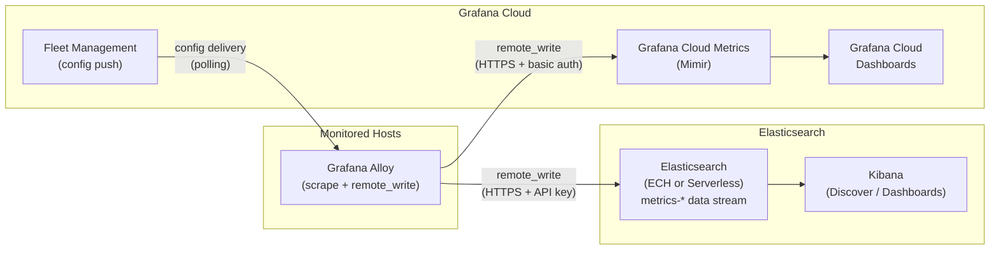

### How It Works

1. **Grafana Alloy** runs on each monitored host, scraping `/metrics` endpoints locally.
2. **Fleet Management** in Grafana Cloud holds the canonical Alloy configuration. Each Alloy instance polls Fleet Management and applies config updates automatically — no SSH or manual restarts required.
3. **Alloy remote_write** fans out scraped samples to both Grafana Cloud Metrics (Mimir) and Elasticsearch in parallel.
4. **Grafana Cloud dashboards** visualise data from Grafana Cloud Metrics; **Kibana** queries Elasticsearch — same data in both observability planes.

### Prerequisites

| Requirement | Notes |
|-------------|-------|
| Grafana Alloy | [grafana.com/docs/alloy/latest/get-started/install/](https://grafana.com/docs/alloy/latest/get-started/install/) |
| Grafana Cloud account | Fleet Management requires a Grafana Cloud stack |
| Elasticsearch 9.4+ or Serverless | Elastic Cloud Hosted or Serverless deployment |
| Elasticsearch API Key | `write` access to `metrics-*` data streams |

### Setup

#### 1. Open the Fleet Management Config Editor

In Grafana Cloud, navigate to **Fleet Management → Remote Configuration → Editor**.

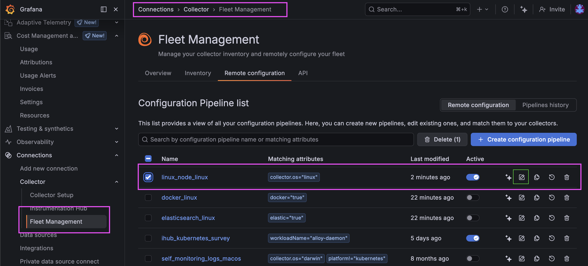

You will see an auto-generated Alloy configuration. The two blocks relevant to this setup are explained below.

**`prometheus.relabel`** — filters which metrics are forwarded

```alloy
prometheus.relabel "integrations_node_exporter" {
    forward_to = [prometheus.remote_write.metrics_service.receiver]

    rule {
        source_labels = ["__name__"]
        regex         = "up|node_arp_entries|node_boot_time_seconds|..."
    }
}
```

This component sits between the scraper and the remote_write destination. It filters scraped samples by metric name and forwards the matching set to `prometheus.remote_write.metrics_service.receiver`.

**`prometheus.remote_write "metrics_service"`** — ships metrics to Grafana Cloud

```alloy
prometheus.remote_write "metrics_service" {
    endpoint {
        url = "https://prometheus-prod-12-prod-us-west-0.grafana.net/api/prom/push"

        basic_auth {
            username = "12345"
            password = sys.env("GCLOUD_RW_API_KEY")
        }
    }
}
```

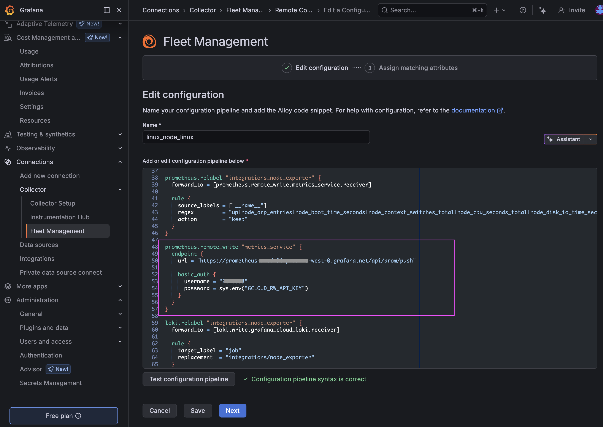

- `username` — your Grafana Cloud **instance ID** (numeric, found in the Cloud Portal)
- `password` — read from the `GCLOUD_RW_API_KEY` environment variable at runtime (never hardcoded)

#### 2. Add an Elasticsearch `remote_write` Endpoint

Add a second `endpoint` block inside the same `prometheus.remote_write "metrics_service"` component. Both endpoints receive the same filtered metrics simultaneously.

```alloy
prometheus.remote_write "metrics_service" {
    endpoint {
        url = "https://prometheus-prod-12-prod-us-west-0.grafana.net/api/prom/push"

        basic_auth {
            username = "12345"
            password = sys.env("GCLOUD_RW_API_KEY")
        }
    }

    endpoint {
        url = "https://<YOUR_ES_ENDPOINT>/_prometheus/api/v1/write"
        // ECH:        https://<cluster-id>.es.<region>.aws.elastic-cloud.com/_prometheus/api/v1/write
        // Serverless: https://<project-id>.es.<region>.aws.elastic.co/_prometheus/api/v1/write

        headers = {
            "Authorization" = "ApiKey <YOUR_BASE64_API_KEY>",
        }
    }
}
```

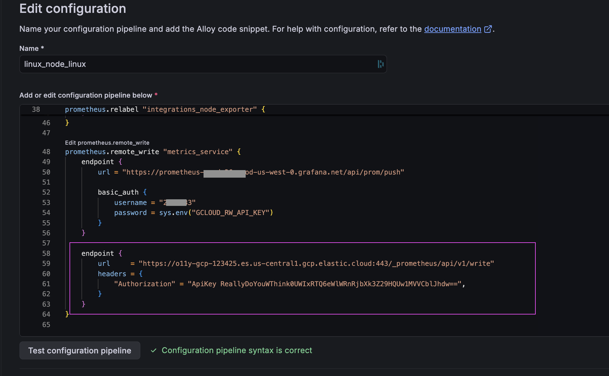

> **Note:** Alloy uses `headers` for the Elasticsearch endpoint rather than the `authorization` block used in standalone Prometheus. Pass the full `ApiKey <encoded>` string as the `Authorization` header value.

Save and publish the config in Fleet Management — all enrolled Alloy agents will pick up the change on their next poll cycle (typically within 60 seconds). No restarts required.

#### 3. Verify Data is Flowing

Confirm data in Elasticsearch — Kibana → Discover → ES|QL:
```esql
TS metrics-generic.prometheus-default
```
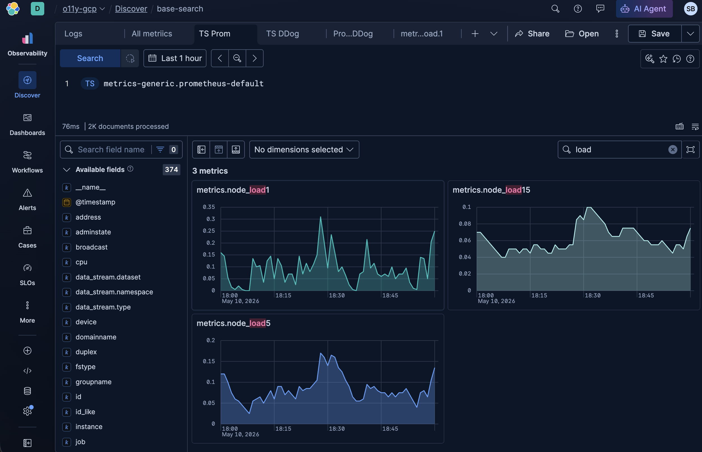

Confirm data in Grafana Cloud — your stack → Explore → Metrics:

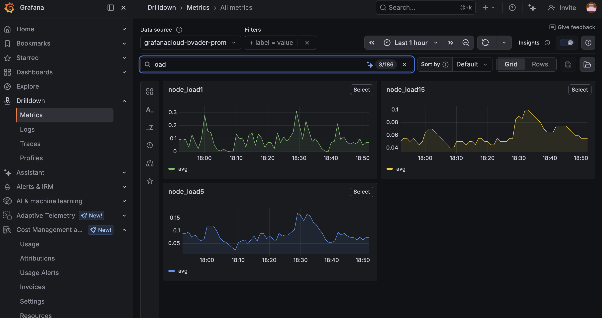


#### 4. Troubleshooting

If the metrics are not flowing, go to Connections → Fleet Management → click the host you configured → Logs. Review the messages, fix the issue, and try again.

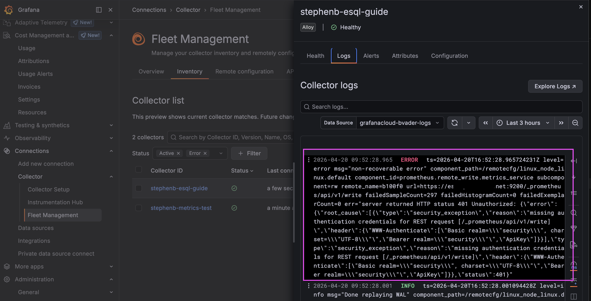

---

## Grafana 2: Prometheus + Grafana → Elasticsearch

**Config:** [`grafana/prometheus-grafana/prometheus.yml`](grafana/prometheus-grafana/prometheus.yml)

Ship metrics from a Prometheus stack — self-managed or via Grafana Cloud — into Elasticsearch using Prometheus `remote_write`. Both destinations can run simultaneously from a single Prometheus instance.

Add one or more `remote_write` blocks to your existing Prometheus config to ship metrics directly to Elasticsearch. This approach works for self-managed Prometheus with self-managed Grafana or Grafana Cloud.

### Architecture: Self-Managed Grafana

Prometheus scrapes local targets and ships metrics directly to Elasticsearch. A self-managed Grafana instance queries Elasticsearch for dashboards.

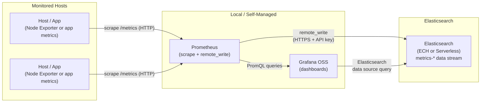

### Architecture: Prometheus → Grafana Cloud + Elasticsearch

Prometheus fans out via `remote_write` to both Grafana Cloud Metrics and Elasticsearch simultaneously.

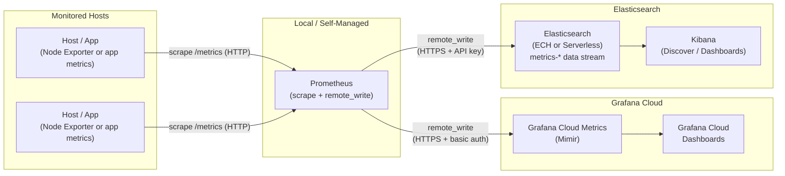

### How It Works

1. Prometheus scrapes `/metrics` endpoints on target hosts at the configured interval.
2. **remote_write to Elasticsearch** — every sample is forwarded over HTTPS using an Elasticsearch API key. Metrics land in the `metrics-generic.prometheus-default` data stream.
3. **remote_write to Grafana Cloud** _(optional)_ — the same samples are also forwarded to Grafana Cloud Metrics (Mimir) using basic auth (instance ID + API token). Both `remote_write` entries can be active simultaneously.

### Prerequisites

| Requirement | Notes |
|-------------|-------|
| Prometheus 2.x | [prometheus.io/download](https://prometheus.io/download/) |
| Elasticsearch 9.4+ or Serverless | Elastic Cloud Hosted or Serverless deployment |
| Elasticsearch API Key | `write` access to `metrics-*` data streams |
| Grafana OSS 10.x+ _(optional)_ | For self-managed dashboards |
| Grafana Cloud account _(optional)_ | For cloud metrics |
| Node Exporter _(optional)_ | For host-level OS metrics |

### Setup

#### 1. (Grafana Cloud only) Get Your Remote Write Credentials

In the Grafana Cloud Portal:
1. Navigate to your stack → **Prometheus** → **Remote Write endpoint**
2. Copy the endpoint URL and your **Instance ID**
3. Create an Access Policy token with `metrics:write` scope — this is your password

#### 2. Configure Prometheus `remote_write`

Add the following to your `prometheus.yml`. If you already have a Grafana Cloud `remote_write` block, just add the Elasticsearch `- url` entry alongside it.

```yaml
remote_write:
  # --- Elasticsearch ---
  - url: "https://<YOUR_ES_ENDPOINT>/_prometheus/api/v1/write"
    name: elasticsearch
    authorization:
      type: ApiKey
      credentials: "<YOUR_BASE64_API_KEY>"
    queue_config:
      capacity: 10000
      max_shards: 50
      max_samples_per_send: 5000
      batch_send_deadline: 5s

  # --- Grafana Cloud (uncomment to enable) ---
  #- url: "https://<YOUR_GRAFANA_CLOUD_PROM_ENDPOINT>/api/prom/push"
  #  name: grafana-cloud
  #  basic_auth:
  #    username: "<YOUR_GRAFANA_CLOUD_INSTANCE_ID>"
  #    password: "<YOUR_GRAFANA_CLOUD_API_TOKEN>"
  #  queue_config:
  #    capacity: 10000
  #    max_shards: 50
  #    max_samples_per_send: 5000
  #    batch_send_deadline: 5s
```

> **Serverless note:** The `remote_write` URL and API key auth are identical for ECH and Serverless. Serverless auto-scales ingest so `queue_config` tuning is less critical, but still recommended for high-volume environments.

#### 3. Verify Data is Flowing

Check Prometheus self-metrics for write activity:

```bash
curl -s http://localhost:9090/metrics | grep prometheus_remote_storage_samples_in_total
```

Confirm data in Elasticsearch — Kibana → Discover → ES|QL:

```esql
TS metrics-generic.prometheus-default
```

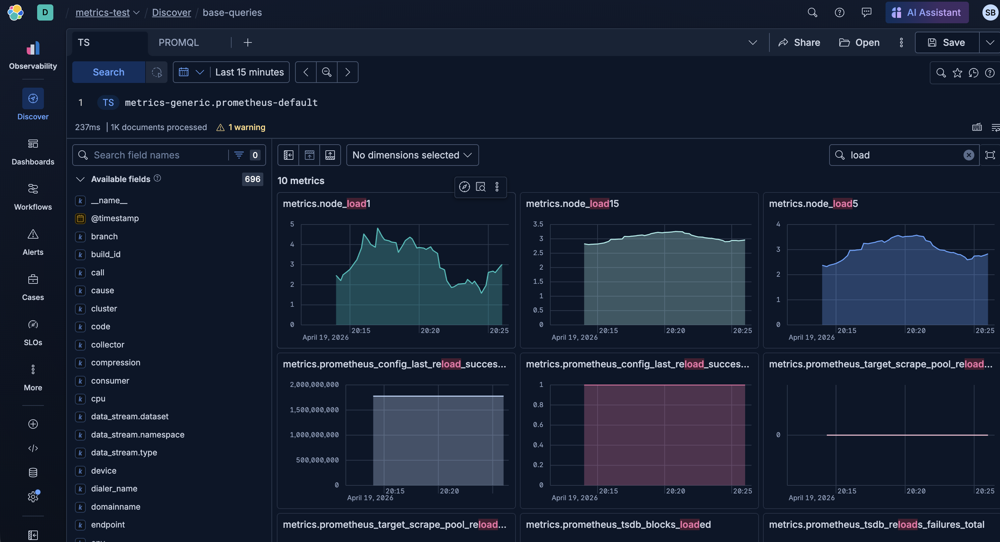

---

## DataDog 1: DataDog Agent → OTEL Collector → Elasticsearch

**Config:** [`datadog/agent-otel-elasticsearch/`](datadog/agent-otel-elasticsearch/)

The DataDog Agent already collects host metrics, traces, and logs and ships them to the DataDog platform. This use case adds a second destination — Elasticsearch — without replacing DataDog. The DataDog Agent emits metrics via OTLP to a local OpenTelemetry Collector, which forwards them to Elasticsearch.

### Architecture: DataDog Agent → DataDog (Baseline)

Before adding Elasticsearch, this is the existing flow: the DataDog Agent running on each host scrapes system and application metrics and ships them to the DataDog platform via the DataDog intake API.

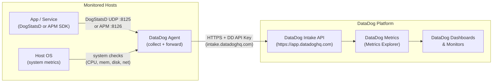

### How It Works (Baseline)

1. **Applications** emit custom metrics and APM traces to the local DataDog Agent via DogStatsD (UDP port 8125) or the APM SDK (TCP port 8126).
2. **Host checks** — the Agent's built-in system check scrapes CPU, memory, disk I/O, and network metrics from the OS at the configured interval (default 15 s).
3. **DataDog Agent** batches and forwards all collected data to the DataDog intake API over HTTPS, authenticated with a DataDog API key.
4. **DataDog Metrics Explorer** and **Dashboards** provide visualisation and alerting over the ingested data.

> The sections below insert an OTEL Collector between the DataDog Agent and DataDog. The Collector receives all metrics from the Agent and fans them out to both DataDog and Elasticsearch — the existing DataDog flow is fully preserved.

---

### How It Works

1. **DataDog Agent** continues to ship metrics directly to `app.datadoghq.com` via its primary `dd_url` — this path is completely unchanged.
2. **`additional_endpoints`** in `datadog.yaml` instructs the Agent to also post a copy of all metrics to the local OTEL Collector on port 8080, using the same DataDog wire format.
3. **OTEL Collector `datadogreceiver`** accepts that copy and has no outbound connection to DataDog — it is purely an Elasticsearch forwarder.
4. **`otlp/elasticsearch` exporter** ships the metrics to Elasticsearch via OTLP gRPC. Metrics land in `metrics-*` data streams, namespaced by OTLP resource attributes. The config also defines an `elasticsearch` exporter (native ES exporter) as a commented-out alternative — swap it into the pipeline if you prefer document-level control over the OTLP path.

### OTEL Collector Deployment Patterns

The OTEL Collector can be deployed in two ways. The choice depends on your environment size and network topology.

#### Option A — Same-Host Collector

The Collector runs on the **same host** as the DataDog Agent. Each host runs its own Collector instance. `additional_endpoints` in `datadog.yaml` points to `localhost:8080`.

- Simple to set up — no network changes required
- Each host is self-contained; the Collector only sees metrics from its own Agent
- Suitable for small environments or where routing to a central host is impractical

> **Note on port 8080:** The DataDog Agent ships with a built-in OTEL Collector that already listens on the default DataDog receiver port (`:4317`/`:4318`). To avoid a port conflict when running your own OTEL Collector Contrib on the same host, this example uses `:8080` instead.

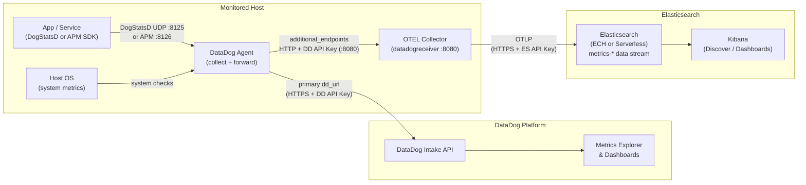

#### Option B — Gateway Collector

A **single OTEL Collector** runs on a dedicated host and receives metrics from **multiple DataDog Agents**. Each Agent's `additional_endpoints` points to the Collector host's IP/hostname instead of `localhost`.

- One Collector instance serves all hosts — fewer components to manage
- Requires the Collector host to be reachable from all Agent hosts on port 8080
- Scales horizontally: run the Collector behind a load balancer for high-volume environments

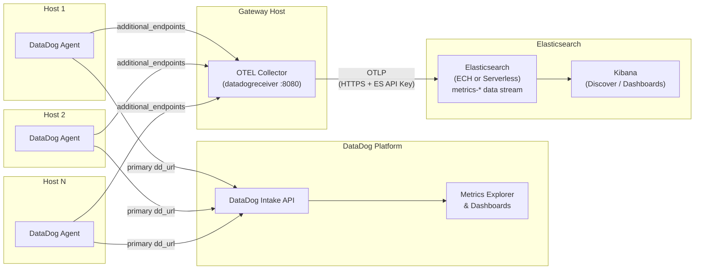


---

### Prerequisites

| Requirement | Notes |
|-------------|-------|
| DataDog Agent 7.x | [docs.datadoghq.com/agent/](https://docs.datadoghq.com/agent/) |
| OTEL Collector Contrib | Must use the **contrib** distribution for `datadogreceiver`; `otlphttp` exporter is in both core and contrib |
| Elasticsearch 9.4+ or Serverless | Elastic Cloud Hosted or Serverless deployment |
| Elasticsearch API Key | `write` access to `metrics-*` data streams (see [Common Prerequisites](#common-prerequisites)) |
| DataDog API Key | Same key the Agent already uses |

### Setup

#### 1. Install OTEL Collector Contrib

The **contrib** distribution is required — it contains `datadogreceiver`. The `otlphttp` exporter used to ship to Elasticsearch is included in both core and contrib.

Please refer to the official installation documentation: [opentelemetry.io/docs/collector/install/](https://opentelemetry.io/docs/collector/install/)

**Docker**
```bash
docker pull otel/opentelemetry-collector-contrib:latest
```

#### 2. Configure the OTEL Collector

Copy [`./datadog/agent-otel-elasticsearch/otel-collector-config.yaml`](./datadog/agent-otel-elasticsearch/otel-collector-config.yaml) and fill in your values:

| Placeholder | Where to find it |
|-------------|-----------------|
| `<ELASTIC_CLOUD_INGEST_ENDPOINT>` | Elastic Cloud console → Deployment → Copy the OTLP endpoint (gRPC, typically `https://<deployment>.ingest.<region>.aws.elastic-cloud.com`) |
| `<YOUR_BASE64_API_KEY>` | The `encoded` field from the API key creation response (see [Common Prerequisites](#common-prerequisites)) |

Start the Collector:

```bash
# Binary
otelcol-contrib --config otel-collector-config.yaml

# Docker
docker run --rm \
  -v $(pwd)/otel-collector-config.yaml:/etc/otelcol-contrib/config.yaml \
  -p 8080:8080 \
  otel/opentelemetry-collector-contrib:latest
```

#### 3. Add the OTEL Collector as an Additional Endpoint

For this walkthrough we use Docker to run the OTEL Collector (see Step 2 above). The `otel-collector-config.yaml` is identical regardless of whether you use the same-host or gateway deployment pattern — only the `additional_endpoints` address in the DataDog Agent config changes.

Edit `/etc/datadog-agent/datadog.yaml` and add the `additional_endpoints` block pointing at your OTEL Collector (use `localhost:8080` for Option A, or the gateway host IP for Option B — see [Deployment Patterns](#otel-collector-deployment-patterns) above):

```yaml
additional_endpoints:
  "http://localhost:8080":
    - <YOUR_DD_API_KEY>
```

Then restart the DataDog Agent to apply the change:

```bash
sudo systemctl restart datadog-agent
```

After restarting the Agent you should be able to see the updated `datadog.yaml` configuration reflected in the DataDog Fleet Management UI.

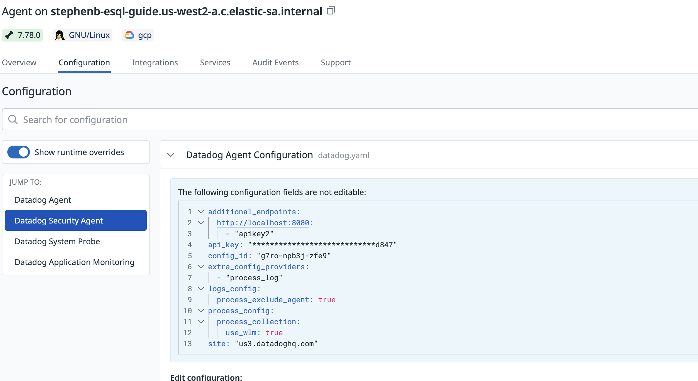

#### 4. Verify Data is Flowing

**Check the OTEL Collector logs** — you should see metrics received and exported without errors:

```bash
# Look for "MetricsExporter" log lines from the otlphttp/elasticsearch exporter
journalctl -u otelcol-contrib -f
# or if running in foreground: watch the terminal output
```

**Check DataDog** — metrics should continue appearing in Metrics Explorer uninterrupted (the primary `dd_url` path was never changed).

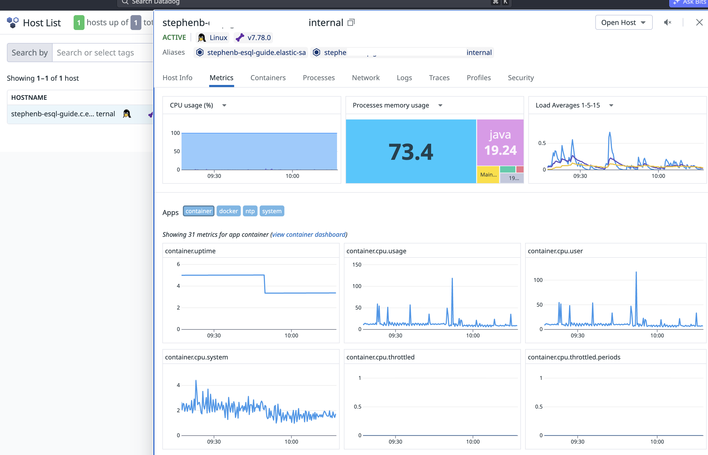

**Check Elasticsearch** — Kibana → Discover → ES|QL:

```esql
TS metrics-datadogreceiver.otel-default
```

And you should see something like this.

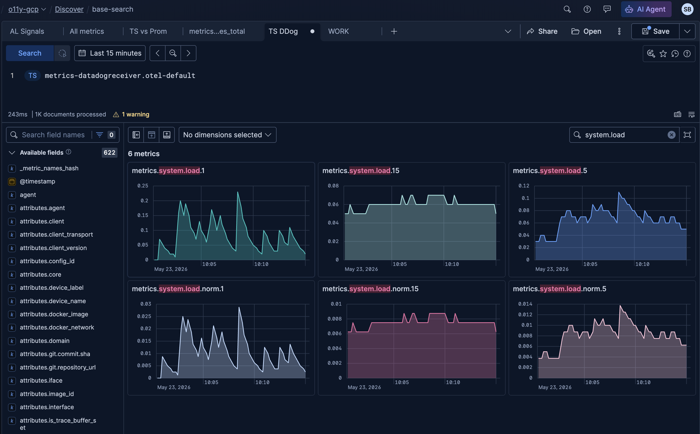

---

## Full Local Test: Node Exporter + Prometheus → Elasticsearch

End-to-end walkthrough to get metrics flowing from your local machine to Elasticsearch in under 10 minutes.

### Prerequisites

| Requirement | Notes |
|-------------|-------|
| Node Exporter | [github.com/prometheus/node_exporter/releases](https://github.com/prometheus/node_exporter/releases) — downloaded in Step 1 |
| Prometheus 2.x | [prometheus.io/download](https://prometheus.io/download/) — downloaded in Step 2 |
| Elasticsearch 9.4+ or Serverless | Elastic Cloud Hosted or Serverless deployment |
| Elasticsearch API Key | `write` access to `metrics-*` data streams (see [Common Prerequisites](#common-prerequisites)) |
| Docker _(optional)_ | Required only for the Grafana step (Step 4) |

### Setup

#### Step 1 — Download and Run Node Exporter

Node Exporter exposes host-level OS metrics (CPU, memory, disk, network) on port `9100`.

**macOS**
```bash
# Download (Apple Silicon — change darwin-arm64 to darwin-amd64 for Intel)
curl -LO https://github.com/prometheus/node_exporter/releases/latest/download/node_exporter-$(curl -s https://api.github.com/repos/prometheus/node_exporter/releases/latest | grep tag_name | cut -d'"' -f4 | tr -d v)-darwin-arm64.tar.gz
tar xzf node_exporter-*.tar.gz
cd node_exporter-*/
./node_exporter
```

**Linux**
```bash
curl -LO https://github.com/prometheus/node_exporter/releases/latest/download/node_exporter-$(curl -s https://api.github.com/repos/prometheus/node_exporter/releases/latest | grep tag_name | cut -d'"' -f4 | tr -d v)-linux-amd64.tar.gz
tar xzf node_exporter-*.tar.gz
cd node_exporter-*/
./node_exporter
```

Verify: `curl -s http://localhost:9100/metrics | head -20`

#### Step 2 — Download and Run Prometheus

**macOS**
```bash
curl -LO https://github.com/prometheus/prometheus/releases/latest/download/prometheus-$(curl -s https://api.github.com/repos/prometheus/prometheus/releases/latest | grep tag_name | cut -d'"' -f4 | tr -d v)-darwin-arm64.tar.gz
tar xzf prometheus-*.tar.gz
cd prometheus-*/
```

**Linux**
```bash
curl -LO https://github.com/prometheus/prometheus/releases/latest/download/prometheus-$(curl -s https://api.github.com/repos/prometheus/prometheus/releases/latest | grep tag_name | cut -d'"' -f4 | tr -d v)-linux-amd64.tar.gz
tar xzf prometheus-*.tar.gz
cd prometheus-*/
```

Copy [`grafana/prometheus-grafana/prometheus.yml`](grafana/prometheus-grafana/prometheus.yml) into the extracted directory. The config already includes a `scrape_configs` block that targets Node Exporter on `:9100` — fill in your Elasticsearch endpoint and API key in the `remote_write` block:

```yaml
remote_write:
  - url: "https://<YOUR_ES_ENDPOINT>/_prometheus/api/v1/write"
    # ECH:        https://<cluster-id>.es.<region>.aws.elastic-cloud.com/_prometheus/api/v1/write
    # Serverless: https://<project-id>.es.<region>.aws.elastic.co/_prometheus/api/v1/write
    name: elasticsearch
    authorization:
      type: ApiKey
      credentials: "<YOUR_BASE64_API_KEY>"
    queue_config:
      capacity: 10000
      max_shards: 50
      max_samples_per_send: 5000
      batch_send_deadline: 5s
```

Then start Prometheus:

```bash
./prometheus --config.file=prometheus.yml
```

#### Step 3 — Confirm Data is Flowing

```bash
curl -s http://localhost:9090/metrics | grep prometheus_remote_storage_samples_in_total
```

Prometheus UI: `http://localhost:9090`

Test with a quick query

```promql
    avg(node_load1)
```
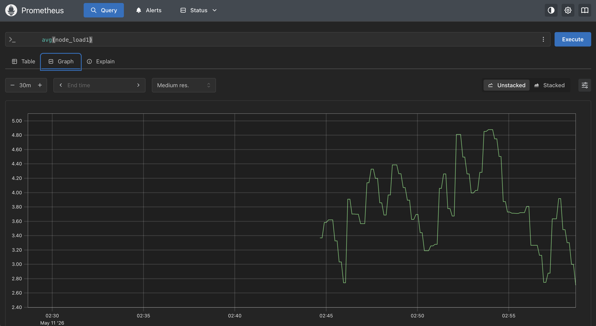

#### Step 4 — View in Grafana (Optional)
If you want to see what it looks like in Grafana that is easy too! 

Simply create a `docker-compose.yml`

```yml
version: '3.8'
services:
  grafana:
    image: grafana/grafana:latest
    container_name: grafana
    restart: unless-stopped
    environment:
      - TERM=linux
      - GF_PLUGINS_PREINSTALL=grafana-clock-panel,grafana-polystat-panel
    ports:
      - '3000:3000'
    volumes:
      - 'grafana_storage:/var/lib/grafana'
volumes:
  grafana_storage: {}
```

```bash
docker compose up -d
```

Navigate to `http://localhost:3000/`

Drilldown → Metrics 

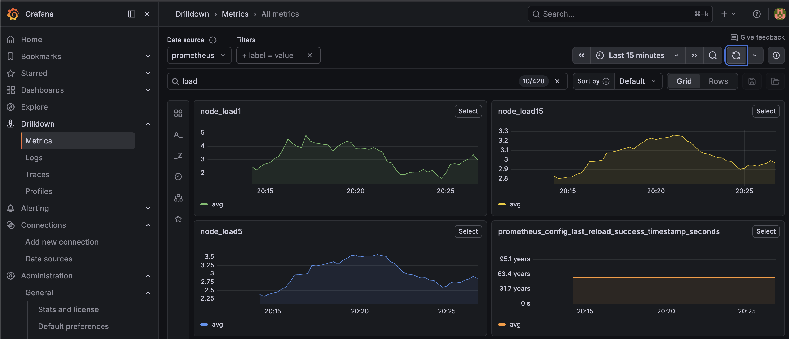


#### Step 5. Verify Data is Flowing

Confirm data in Elasticsearch — Kibana → Discover → ES|QL:
```esql
TS metrics-generic.prometheus-default
```


---
