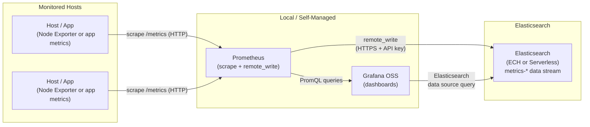
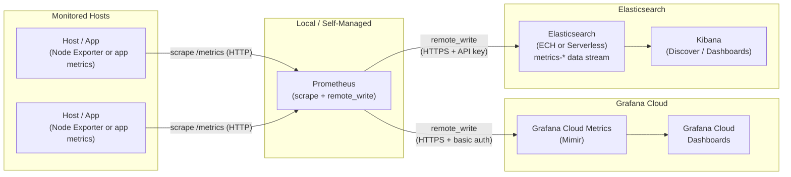

# Prometheus + Grafana → Elasticsearch

Ship metrics from a Prometheus stack — self-managed or via Grafana Cloud — into Elasticsearch using Prometheus `remote_write`. Both destinations can run simultaneously from a single Prometheus instance.

## Quick Summary

Add one `remote_write` blocks to your existing Prometheus config to ship metrics directly to Elasticsearch directly. This approach works for self-managed prometheus with self-managed Grafana or Granfana Cloud. 

---

## Architecture: Self-Managed Grafana

Prometheus scrapes local targets and ships metrics directly to Elasticsearch. A self-managed Grafana instance queries Elasticsearch for dashboards.



---

## Architecture: Prometheus → Grafana Cloud + Elasticsearch

Prometheus fans out via `remote_write` to both Grafana Cloud Metrics and Elasticsearch simultaneously. Grafana Cloud provides managed dashboards; Elasticsearch provides unified observability alongside logs and traces.



---

## How It Works

1. **Prometheus** scrapes `/metrics` endpoints on target hosts at the configured interval.
2. **remote_write to Elasticsearch** — every sample is forwarded over HTTPS using an Elasticsearch API key. Metrics land in the `metrics-generic.prometheus-default` data stream.
3. **remote_write to Grafana Cloud** _(optional)_ — the same samples are also forwarded to Grafana Cloud Metrics (Mimir) using basic auth (instance ID + API token). Both `remote_write` entries can be active at the same time.
4. **Grafana Cloud dashboards** query Grafana Cloud Metrics; **Kibana** queries Elasticsearch — same underlying data, two observability surfaces.

---

## Prerequisites

| Requirement | Notes |
|-------------|-------|
| Prometheus 2.x | [prometheus.io/download](https://prometheus.io/download/) |
| Elasticsearch 8.x or Serverless | Elastic Cloud Hosted or Serverless deployment |
| Elasticsearch API Key | `write` access to `metrics-*` data streams |
| Grafana OSS 10.x+ _(optional)_ | [grafana.com/grafana/download](https://grafana.com/grafana/download/) — for self-managed dashboards |
| Grafana Cloud account _(optional)_ | [grafana.com/auth/sign-up](https://grafana.com/auth/sign-up/) — for cloud metrics |
| Node Exporter _(optional)_ | For host-level OS metrics |

---

## Setup

### 1. Create an Elasticsearch API Key

In Kibana → Stack Management → API Keys, create a key with the following minimum privileges:

```json
{
  "metrics_writer": {
    "indices": [
      {
        "names": ["metrics-*"],
        "privileges": ["create_index", "create", "index", "auto_configure"]
      }
    ]
  }
}
```

### 2. (Grafana Cloud only) Get Your Remote Write Credentials

In the Grafana Cloud Portal:
1. Navigate to your stack → **Prometheus** → **Remote Write endpoint**
2. Copy the endpoint URL and your **Instance ID**
3. Create an Access Policy token with `metrics:write` scope — this is your password

### 3. Configure Prometheus `remote_write`

Copy [`prometheus.yml`](prometheus.yml) from this directory, replace the `<PLACEHOLDER>` values, and uncomment the Grafana Cloud block if needed:

```yaml
remote_write:
  # --- Elasticsearch ---
  - url: "https://<YOUR_ES_ENDPOINT>/_prometheus/api/v1/write"
    name: elasticsearch
    authorization:
      type: ApiKey
      credentials: "<YOUR_BASE64_API_KEY>"
    queue_config:
      capacity: 10000
      max_shards: 50
      max_samples_per_send: 5000
      batch_send_deadline: 5s

  # --- Grafana Cloud (uncomment to enable) ---
  #- url: "https://<YOUR_GRAFANA_CLOUD_PROM_ENDPOINT>/api/prom/push"
  #  name: grafana-cloud
  #  basic_auth:
  #    username: "<YOUR_GRAFANA_CLOUD_INSTANCE_ID>"
  #    password: "<YOUR_GRAFANA_CLOUD_API_TOKEN>"
  #  queue_config:
  #    capacity: 10000
  #    max_shards: 50
  #    max_samples_per_send: 5000
  #    batch_send_deadline: 5s
```

> **Serverless note:** The Elasticsearch `remote_write` URL and API key auth are identical for ECH and Serverless. Serverless auto-scales ingest so `queue_config` tuning is less critical, but still recommended for high-volume environments.

### 4. Verify Remote Write is Working

Check Prometheus self-metrics for write activity:

```bash
curl -s http://localhost:9090/metrics | grep prometheus_remote_storage_samples_in_total
```

Look for the counter incrementing on each scrape interval.

**Confirm data in Elasticsearch** — go to Kibana → Discover → ES|QL and run:

```esql
TS metrics-generic.prometheus-default
```


### 5. Configure Grafana to Visualise Elasticsearch Metrics

> **TODO:** Add steps for configuring Elasticsearch as a Grafana data source and building a dashboard from the `metrics-generic.prometheus-default` data stream.

---

## ECH vs. Serverless Differences

| Feature | Elastic Cloud Hosted | Elastic Serverless |
|---------|---------------------|-------------------|
| URL format | `https://<cluster-id>.es.<region>.aws.elastic-cloud.com` | `https://<project-id>.es.<region>.aws.elastic.co` |
| Auth | API Key or username/password | API Key only |

---

## File Reference

| File | Description |
|------|-------------|
| [`prometheus.yml`](prometheus.yml) | Prometheus config with `remote_write` to Elasticsearch and optional Grafana Cloud |

---

## Full Local Test: Node Exporter + Prometheus → Elasticsearch

End-to-end walkthrough to get metrics flowing from your local machine to Elasticsearch in under 10 minutes.

### Step 1 — Download and Run Node Exporter

Node Exporter exposes host-level OS metrics (CPU, memory, disk, network) on port `9100`.

**macOS**
```bash
# Download (Apple Silicon — change darwin-arm64 to darwin-amd64 for Intel)
curl -LO https://github.com/prometheus/node_exporter/releases/latest/download/node_exporter-$(curl -s https://api.github.com/repos/prometheus/node_exporter/releases/latest | grep tag_name | cut -d'"' -f4 | tr -d v)-darwin-arm64.tar.gz

# Extract and run
tar xzf node_exporter-*.tar.gz
cd node_exporter-*/
./node_exporter
```

**Linux**
```bash
# Download
curl -LO https://github.com/prometheus/node_exporter/releases/latest/download/node_exporter-$(curl -s https://api.github.com/repos/prometheus/node_exporter/releases/latest | grep tag_name | cut -d'"' -f4 | tr -d v)-linux-amd64.tar.gz

# Extract and run
tar xzf node_exporter-*.tar.gz
cd node_exporter-*/
./node_exporter
```

Verify it's running:
```bash
curl -s http://localhost:9100/metrics | head -20
```

### Step 2 — Download and Run Prometheus

**macOS**
```bash
# Download (Apple Silicon — change darwin-arm64 to darwin-amd64 for Intel)
curl -LO https://github.com/prometheus/prometheus/releases/latest/download/prometheus-$(curl -s https://api.github.com/repos/prometheus/prometheus/releases/latest | grep tag_name | cut -d'"' -f4 | tr -d v)-darwin-arm64.tar.gz

# Extract
tar xzf prometheus-*.tar.gz
cd prometheus-*/
```

**Linux**
```bash
# Download
curl -LO https://github.com/prometheus/prometheus/releases/latest/download/prometheus-$(curl -s https://api.github.com/repos/prometheus/prometheus/releases/latest | grep tag_name | cut -d'"' -f4 | tr -d v)-linux-amd64.tar.gz

# Extract
tar xzf prometheus-*.tar.gz
cd prometheus-*/
```

Copy the [`prometheus.yml`](prometheus.yml) from this repo into the extracted directory, fill in your Elasticsearch endpoint and API key, then start Prometheus:

```bash
./prometheus --config.file=prometheus.yml
```

Prometheus UI will be available at `http://localhost:9090`.

### Step 3 — Confirm Data is Flowing

**Check Prometheus remote_write status:**
```bash
curl -s http://localhost:9090/metrics | grep prometheus_remote_storage_samples_in_total
```

Look for the counter incrementing on each scrape interval.

**Confirm data in Elasticsearch using ES|QL in Kibana → Discover:**
```esql
TS metrics-generic.prometheus-default
```

**Confirm data in Grafana using Drilldown → Metrics:**


